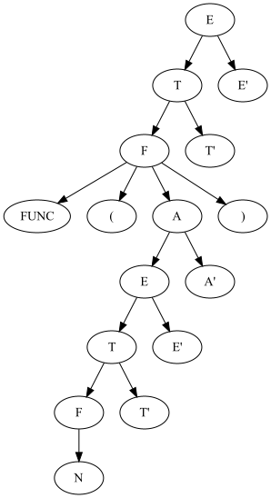

# Лабораторная работа №2. Ручное построение нисходящих синтаксических анализаторов

Цель данной лабораторной работы — научиться разрабатывать грамматики для заданных неформально языков с учетом
семантического
смысла и приоритета операторов, разрабатывать лексические анализаторы, разрабатывать вручную нисходящие синтаксические
анализаторы,
разрабатывать подробные тестовые наборы для анализаторов.

## Вариант 1. Арифметические выражения

Арифметические выражения с операциями сложения, вычитания,
умножения, скобками, унарным минусом и унарными функциями. Приоритет операций стандартный. Скобки используются для
изменения приоритета и передачи аргументов в функции.
В качестве операндов выступают целые числа. Используйте один терминал для всех чисел. Любая последовательность букв
задает имя функции. Используйте один терминал для всех функций.
Пример: (1 + 2) * sin(-3 * (7 - 4) + 2)

## Грамматика

```
E -> T E';
E' -> + T E' | - T E' | epsilon;
T -> F T';
T' -> * F T' | epsilon;
F -> ( E ) | - F | FUNC F | n;
```

## First и Follow

|    | First         | Follow        |
|----|---------------|---------------|
| E  | (, -, N, FUNC | $, )          |
| T  | (, -, N, FUNC | +, -, $, )    |
| F  | (, -, N, FUNC | *, +, -, $, ) |
| E' | +, -, epsilon | $, )          |
| T' | *, epsilon    | +, -, $, )    |

## Пример парсинга

Одно число: <br/>
<br/>
Одно число в скобках: <br/>
<br/>
sin 30: <br/>
<br/>
cos(60): <br/>
")<br/>
1 + 2: <br/>
<br/>
52 * 812: <br/>
<br/>
1 + 2 * 3:<br/>
<br/>
1 * 2 + 3:<br/>
<br/>
(1+2) * sin(-3*(7-4)+2):<br/>
<br/>

