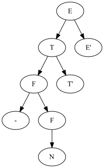
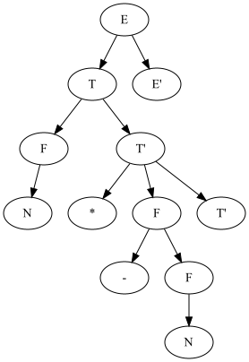

# Лабораторная работа №2. Ручное построение нисходящих синтаксических анализаторов

Цель данной лабораторной работы — научиться разрабатывать грамматики для заданных неформально языков с учетом
семантического
смысла и приоритета операторов, разрабатывать лексические анализаторы, разрабатывать вручную нисходящие синтаксические
анализаторы,
разрабатывать подробные тестовые наборы для анализаторов.

## Вариант 1. Арифметические выражения

Арифметические выражения с операциями сложения, вычитания,
умножения, скобками, унарным минусом и унарными функциями. Приоритет операций стандартный. Скобки используются для
изменения приоритета и передачи аргументов в функции.
В качестве операндов выступают целые числа. Используйте один терминал для всех чисел. Любая последовательность букв
задает имя функции. Используйте один терминал для всех функций.
Пример: (1 + 2) * sin(-3 * (7 - 4) + 2)

## Грамматика

```
E -> T E';
E' -> + T E' | - T E' | epsilon;
T -> F T';
T' -> * F T' | epsilon;
F -> ( E ) | - F | FUNC F | n;
```

### Нетерминалы

| Нетерминал | Описание                                                                                     |
|------------|----------------------------------------------------------------------------------------------|
| E          | Арифметическое выражение.                                                                    |
| E'         | нетерминал с оператором сложения и вычитания.                                                |
| T          | терм, либо атомарное значение F, либо результат умножения.                                   |
| T'         | нетерминал с оператором умножения                                                            |
| F          | фактор --- это число, выражение в скобках, унарный минус, либо функция примененная к фактору |

## Лексический анализатор

| Терминал | Токен    |
|----------|----------|
| (        | LPAREN   |
| )        | RPAREN   |
| $        | END      |
| +        | PLUS     |
| -        | MINUS    |
| *        | MULTIPLY |
| somefunc | FUNC     |
| число    | N        |

```java
package ru.ainur.parser;

import java.io.IOException;
import java.io.InputStream;
import java.text.ParseException;
import java.util.function.Predicate;

public class LexicalAnalyzer {
    private final InputStream is;
    private int curChar;
    private int curPos;
    private Token curToken;

    public LexicalAnalyzer(InputStream is) throws ParseException {
        this.is = is;
        curPos = 0;
        nextChar();
    }

    private boolean isBlank(int c) {
        return c == ' ' || c == '\r' || c == '\n' || c == '\t';
    }

    private void nextChar() throws ParseException {
        curPos++;
        try {
            curChar = is.read();
        } catch (IOException e) {
            throw new ParseException(e.getMessage(), curPos);
        }
    }

    public void nextToken() throws ParseException {
        skipWs();
        if (checkSequence(Character::isDigit, Token.N)) {
            return;
        }
        if (checkSequence(Character::isLetter, Token.FUNC)) {
            return;
        }

        switch (curChar) {
            case '(' -> {
                nextChar();
                curToken = Token.LPAREN;
            }
            case '-' -> {
                nextChar();
                curToken = Token.MINUS;
            }
            case ')' -> {
                nextChar();
                curToken = Token.RPAREN;
            }
            case '+' -> {
                nextChar();
                curToken = Token.PLUS;
            }
            case '*' -> {
                nextChar();
                curToken = Token.MULTIPLY;
            }
            case -1 -> curToken = Token.END;
            default -> throw new ParseException("Illegal character: " + (char) curChar, curPos);
        }
    }

    private void skipWs() throws ParseException {
        while (isBlank(curChar)) {
            nextChar();
        }
    }

    private boolean checkSequence(Predicate<Integer> predicate, Token token) throws ParseException {
        if (predicate.test(curChar)) {
            curToken = token;
            while (predicate.test(curChar)) {
                nextChar();
            }
            return true;
        }
        return false;
    }

    public Token curToken() {
        return curToken;
    }

    public int curPos() {
        return curPos;
    }
}
```

## Синтаксический анализатор

### First и Follow

|    | First         | Follow        |
|----|---------------|---------------|
| E  | (, -, N, FUNC | $, )          |
| T  | (, -, N, FUNC | +, -, $, )    |
| F  | (, -, N, FUNC | *, +, -, $, ) |
| E' | +, -, epsilon | $, )          |
| T' | *, epsilon    | +, -, $, )    |

Грамматика LL(1)

```java
package ru.ainur.parser;

import java.io.ByteArrayInputStream;
import java.io.InputStream;
import java.nio.charset.StandardCharsets;
import java.text.ParseException;

public class BaseParser {
    private final LexicalAnalyzer lexer;

    public BaseParser(InputStream inputStream) throws ParseException {
        this.lexer = new LexicalAnalyzer(inputStream);
        lexer.nextToken();
    }

    public BaseParser(String s) throws ParseException {
        this(new ByteArrayInputStream(s.getBytes(StandardCharsets.UTF_8)));
    }

    public Tree parse() throws ParseException {
        Tree tree = E();
        expect(Token.END);
        return tree;
    }

    private Tree E() throws ParseException {
        Tree tree = new Tree("E");
        switch (lexer.curToken()) {
            case LPAREN:
            case MINUS:
            case N:
            case FUNC:
                tree.addChildren(T());
                tree.addChildren(EPrime());
                break;
            case END:
            case RPAREN:
                break;
            default:
                throw new ParseException("Unexpected token at E()", lexer.curPos());
        }
        return tree;
    }

    private Tree EPrime() throws ParseException {
        Tree tree = new Tree("E'");
        switch (lexer.curToken()) {
            case PLUS:
                expect(Token.PLUS);
                tree.addChildren(new Tree("+"));
                lexer.nextToken();

                tree.addChildren(T());
                tree.addChildren(EPrime());
                break;
            case MINUS:
                expect(Token.MINUS);
                tree.addChildren(new Tree("-"));
                lexer.nextToken();

                tree.addChildren(T());
                tree.addChildren(EPrime());
                break;
            case END:
            case RPAREN:
                break;

            default:
                throw new ParseException("Unexpected token at EPrime()", lexer.curPos());

        }
        return tree;
    }

    private Tree T() throws ParseException {
        Tree tree = new Tree("T");
        switch (lexer.curToken()) {
            case LPAREN:
            case MINUS:
            case N:
            case FUNC:
                tree.addChildren(F());
                tree.addChildren(TPrime());
                break;
            default:
                throw new ParseException("Unexpected token at T()", lexer.curPos());
        }

        return tree;
    }


    private Tree TPrime() throws ParseException {
        Tree tree = new Tree("T'");
        switch (lexer.curToken()) {
            case MULTIPLY:
                expect(Token.MULTIPLY);
                tree.addChildren(new Tree("*"));
                lexer.nextToken();
                tree.addChildren(F());
                tree.addChildren(TPrime());
                break;
            case END:
            case PLUS:
            case MINUS:
            case RPAREN:
                break;
            default:
                throw new ParseException("Unexpected token at TPrime()", lexer.curPos());
        }
        return tree;
    }

    private Tree F() throws ParseException {
        Tree tree = new Tree("F");
        switch (lexer.curToken()) {
            case LPAREN:
                //(
                expect(Token.LPAREN);
                tree.addChildren(new Tree("LPAREN"));
                lexer.nextToken();
                //E
                tree.addChildren(E());
                //)
                expect(Token.RPAREN);
                tree.addChildren(new Tree("RPAREN"));
                lexer.nextToken();
                break;

            case N:
                //N
                expect(Token.N);
                tree.addChildren(new Tree("N"));
                lexer.nextToken();
                break;

            case FUNC:
                //FUNC
                expect(Token.FUNC);
                tree.addChildren(new Tree("FUNC"));
                lexer.nextToken();
                //F
                tree.addChildren(F());
                break;

            case MINUS:
                //-
                expect(Token.MINUS);
                tree.addChildren(new Tree("-"));
                lexer.nextToken();
                //F
                tree.addChildren(F());
                break;
            default:
                throw new ParseException("Unexpected token at F()", lexer.curPos());
        }
        return tree;
    }

    private void expect(Token token) throws ParseException {
        if (lexer.curToken() != token) {
            throw new ParseException("Expected " + token + " but found " + lexer.curToken(), lexer.curPos());
        }
    }
}
```

Дополнительный класс, для парсинга одной строки:

```java
package ru.ainur.parser;

import java.text.ParseException;

public class ExpressionParser {
    public Tree parse(String input) throws ParseException {
        return new BaseParser(input).parse();
    }
}
```

## Пример парсинга

Одно число: <br/>
<br/>
Одно отрицательное число: <br/>
<br/>
Одно число в скобках: <br/>
<br/>
sin 30: <br/>
<br/>
cos(60): <br/>
")<br/>
1 + 2: <br/>
<br/>
52 * 812: <br/>
<br/>
1 + 2 * 3:<br/>
<br/>
1 * 2 + 3:<br/>
<br/>
(1+2) * sin(-3*(7-4)+2):<br/>
<br/>

